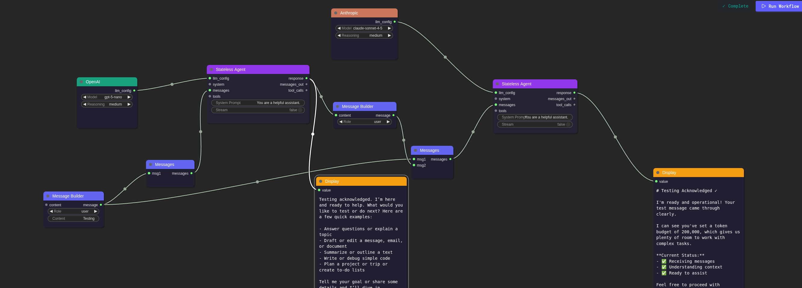

# Play — Visual AI Workflow Builder

A visual node-based workflow builder for AI agents, built with [Phoenix LiveView](https://hexdocs.pm/phoenix_live_view) and [LiteGraph](https://github.com/jagenjo/litegraph.js).



## Features

### Multi-Provider LLM Support

Connect to your favorite AI providers with a unified interface:

- **OpenAI** — GPT-5.2, GPT-5-mini, GPT-5-nano and more
- **Anthropic** — Claude Sonnet 4.5, Claude Opus 4.5, Claude Haiku 4.5
- **Google AI** — Gemini 3 Pro Preview, Gemini 3 Flash Preview
- **xAI** — Grok 4.1, Grok 4, Grok 3

### Powerful Agent Nodes

- **Stateless Agent** — Process messages without retaining conversation history
- **Stateful Agent** — Maintain conversation context across workflow runs
- Configurable system prompts and streaming support

### Rich Node Library

| Category | Nodes |
|----------|-------|
| **Input** | Text Input, Number Input, Variable |
| **Output** | Display, Console |
| **Utility** | Message Builder, Messages Combiner, Prompt Template, JSON Parse, Condition |
| **Tools** | Web Search, Tools Combiner |

### Real-Time Execution

- Visual execution progress with node highlighting
- Streaming responses from LLM providers
- Execution status indicators

### Workflow Management

- Save and load workflows
- Persistent graph storage with PostgreSQL
- User authentication

## Getting Started

### Prerequisites

- Elixir 1.19+
- PostgreSQL
- Node.js (for asset compilation)

### Installation

1. Clone the repository and install dependencies:

```bash
mix setup
```

2. Configure your environment variables for LLM providers:

```bash
export OPENAI_API_KEY="your-key"
export ANTHROPIC_API_KEY="your-key"
# ... other providers
```

3. Start the Phoenix server:

```bash
mix phx.server
```

4. Visit [`localhost:4000`](http://localhost:4000) in your browser

## Usage

1. **Create a new workflow** — Navigate to `/graph` and create a new graph
2. **Add nodes** — Right-click on the canvas to open the context menu
3. **Connect nodes** — Drag from output ports to input ports
4. **Configure nodes** — Click on a node to see its properties in the sidebar
5. **Run workflow** — Click "Run Workflow" to execute your graph

### Example Workflow

The screenshot above shows a workflow that:

1. Configures two LLM providers (OpenAI and Anthropic)
2. Creates user messages using Message Builder nodes
3. Passes messages through Stateless Agent nodes
4. Displays the responses in Display nodes

## Tech Stack

- **[Phoenix Framework](https://www.phoenixframework.org/)** — Web framework
- **[Phoenix LiveView](https://hexdocs.pm/phoenix_live_view)** — Real-time UI updates
- **[LiteGraph.js](https://github.com/jagenjo/litegraph.js)** — Node-based graph editor
- **[LangChain](https://github.com/brainlid/langchain)** — LLM integration
- **[Ecto](https://hexdocs.pm/ecto)** — Database layer
- **[Tailwind CSS](https://tailwindcss.com/)** — Styling
- **[daisyUI](https://daisyui.com/)** — UI components

## Development

Run the precommit checks before pushing:

```bash
mix precommit
```

This will:
- Compile with warnings as errors
- Remove unused dependencies
- Format code
- Run tests

## License

[WTFPL](https://www.wtfpl.net/about/)
